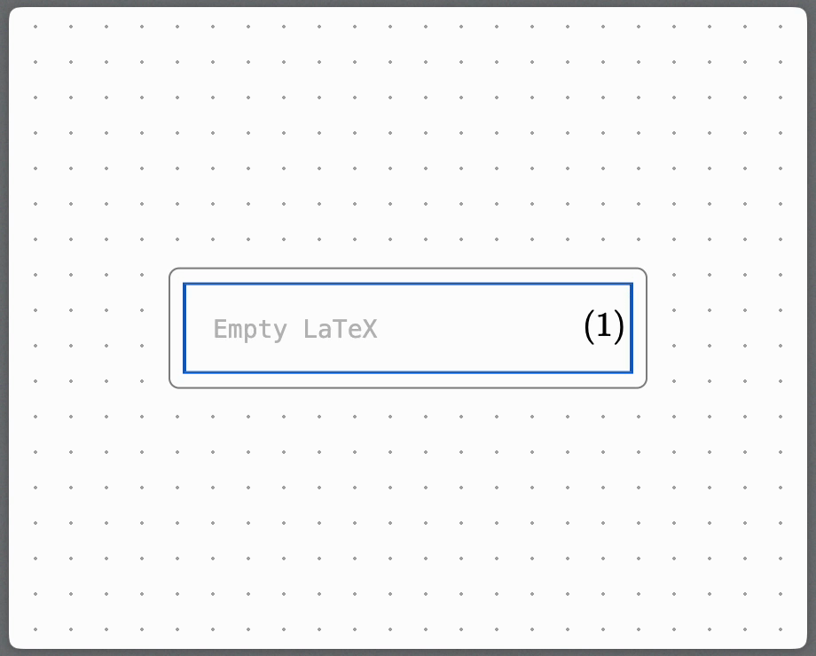

<a href='https://jeffreymaomao.github.io/TexField/dist/'>
    <picture>
        <source media="(prefers-color-scheme: dark)" srcset="./src/img/TexField.dark.png">
        
	</picture>
</a>
 
<h1 align='center'>TexField</h1>

**TexField** is a web application designed for creating and managing LaTeX notes on an infinitely large canvas. By leveraging [KaTeX](https://katex.org/) for LaTeX rendering, TexField enables fast and efficient display of mathematical formulas directly in your browser.

## Getting Started

**TexField** is an online web application. To start using it, simply visit 

    

## Usage / Shortcuts

| MathEditor Action            |       Method (mac OS)        |               Method (Windows)               |
| ---------------------------- | :--------------------------- | :------------------------------------------- |
| Toggle Block Editing mode    | <kbd>command</kbd> + <kbd>/</kbd> |        <kbd>Ctrl</kbd> + <kbd>/</kbd>        |
| Create New Block             | <kbd>command</kbd> + <kbd>return</kbd> |      <kbd>Ctrl</kbd> + <kbd>Enter</kbd>      |
| Delete Foucs Block           | <kbd>command</kbd> + <kbd>delete</kbd> |    <kbd>Ctrl</kbd> + <kbd>Backspace</kbd>    |
| Move focus Up / Down | <kbd>↑</kbd> or <kbd>↓</kbd> | <kbd>Up Arrow</kbd> or <kbd>Down Arrow</kbd> |
| Focus Block                  |            Click Block            |                    Click Block                    |

| TexField Action     | Method (mac OS)                                         | Method (Windows)                                  |
| ------------------- | :------------------------------------------------------ | :------------------------------------------------ |
| Move Canvas         | Scroll Wheel / Drag Canvas                              | Scroll Wheel / Drag Canvas                        |
| Add New Note        | Double Click                                            | Double Click                                      |
| Add Path Link       | <kbd>command</kbd> + <kbd>shift</kbd> + Drag Note       | <kbd>Ctrl</kbd> + <kbd>Shift</kbd> + Drag Note    |
| Focus Note          | <kbd>command</kbd> + Click Note                         | <kbd>Ctrl</kbd> + Click Note                      |
| Focus Path          | Click Path                                              | Click Path                                        |
| Move Note           | <kbd>command</kbd> + Drag Note                          | <kbd>Ctrl</kbd> + Drag Note                       |
| Center Note         | <kbd>command</kbd> + <kbd>option</kbd> + <kbd>1~9</kbd> | <kbd>Ctrl</kbd> + <kbd>Alt</kbd> + <kbd>1~9</kbd> |
| Delete Focused Note | Select Note $\to$ <kbd>delete</kbd>                     | Select Note $\to$ <kbd>Backspace</kbd>            |
| Delete Focused Note | Select Path $\to$ <kbd>delete</kbd>                     | Select Path $\to$ <kbd>Backspace</kbd>            |

| Global Action            | Method (mac OS)                   | Method (Windows)               |
| ------------------------ | --------------------------------- | ------------------------------ |
| Toggle Dark / Light mode | <kbd>command</kbd> + <kbd>b</kbd> | <kbd>Ctrl</kbd> + <kbd>b</kbd> |
| Export JSON              | <kbd>command</kbd> + <kbd>e</kbd> | <kbd>Ctrl</kbd> + <kbd>e</kbd> |
| Print PDF                | <kbd>command</kbd> + <kbd>p</kbd> | <kbd>Ctrl</kbd> + <kbd>p</kbd> |
| Full Screen              | <kbd>command</kbd> + <kbd>f</kbd> | <kbd>Ctrl</kbd> + <kbd>f</kbd> |

## User Interface

    <picture>
        <source media="(prefers-color-scheme: dark)" srcset="./assets/UI-block-dark.png">
        
	</picture>

    <picture>
        <source media="(prefers-color-scheme: dark)" srcset="./assets/UI-block-edit-dark.png">
        
	</picture>

  

    <picture>
      <source media="(prefers-color-scheme: dark)" srcset="./assets/UI-block-add-delete-dark.gif">
      
    </picture>
  

  

    <picture>
      <source media="(prefers-color-scheme: dark)" srcset="./assets/UI-note-canvas-drag-dark.gif">
      
    </picture>
  

    <picture>
        <source media="(prefers-color-scheme: dark)" srcset="./assets/UI-add-path-dark.gif">
        
	</picture>

## Features

- **Infinite Canvas**: Interact with a canvas that expands indefinitely to manage and organize your LaTeX notes and diagrams.
- **KaTeX Integration**: Utilize KaTeX for efficient and accurate LaTeX rendering, supporting a wide range of mathematical notation.

## Technology Stack

 ) ) 

## License

**TexField** is licensed under the MIT License. See the [LICENSE](LICENSE) file for more information.

## Contact

For any questions or feedback, feel free to reach out to us at [jeffrey0613mao@gmail.com](jeffrey0613mao@gmail.com).
